# Lab 1: Backpropagation

```
name	  : 周俊川
student id: 310551002
```

## Table of contents

1. [Introduction](#introduction)
2. [Experiments setups](#experiments-setups)
    a. [Backpropagation](#backpropagation)
    b. [Sigmoid function](#sigmoid-function)
    c. [Neural network](#neural-network)
3. [Results](#results)
    a. [Comparision results](#comparison-results)
    b. [Accuracy and loss curve](#accuracy-and-loss-curve)
4. [Discussion](#discussion)
    a. [Number of hidden units](#number-of-hidden-units)
    b. [Loss functions](#loss-functions)
    c. [Activation functions](#activation-functions)
    d. [Learning rates](#learning-rates)
    e. [Optimizers](#optimizers)
5. [Extra](#extra)
    a. [Implementation of different activation functions](#implementation-of-different-activation-functions)
    b. [Implementation of different optimizers](#implementation-of-different-optimizers)
    c. [Implementation of convolution layer](#implementation-of-convolution-layer)
6. [References](#references)

## Introduction

In this lab, I'm going to familiar with backpropagation algorithms by implementing neural network modules with pure python's **numpy**.
The basic implementation specification of this lab is including: 
- simple neural network with two hidden layer
- sigmoid function
- forward pass / backpropagation functions

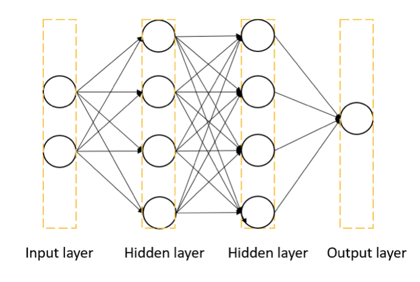

In addition, I also implement and experiment different neural network parameter setups to understand the basic idea of deep learning training, including
- activation function
- loss function
- optimizers

At last, I provide some of the advance computation layer in last section, such as `Convolution2D` layer.

## Experiments setups

The implementation module is implemented in **nnfromscratch**, including
- `layer.py`: implementation of base `Layer` functionalities (basically with **forward** and **backward**) and `Dense`, `Convolution2D`.
- `activation.py`: implementation of various activation functions include `Sigmoid`, `Relu`, `Tanh`.
- `loss.py`: implementation of loss functions include `BinaryCrossEntropy` and `MeanSquareError`.
- `optimizer.py`: implementation of optimizer include `SGD`, `Momentum` and `Adam`.
- `model.py`: implementation of neural network by combining different layer and loss function.

In addition, I setup a config for hyperparameter experiment in `config` folder, and use `main.py` in root directory to execute the experiment.

The dataset that I am going to experiment is random linear data and xor data.
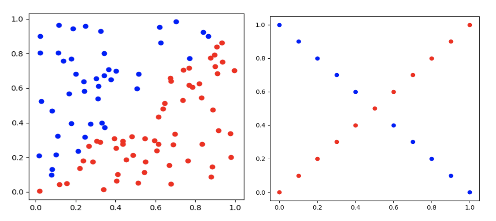

Our base default parameters experiement is set as
- activation: sigmoid
- learning rate: 0.1
- optimizer: sgd
- loss: binary cross entropy
- hidden units size: 16
- epochs: 5000

Some of the implementation details are provided at below.

#### Backpropagation

The neural network backpropagation process is implemented with a base `Layer` and base `Model`, and define each layer of functions's forward / backward algorithm itself afterwards.

```python
class Layer:
    def __init__(self):
        self.params = {}

    def __call__(self, x, **kwargs) -> np.ndarray:
        """
        x: input data
        return: estimated data
        """
        self.forward(x, **kwargs)
        return self.output

    def forward(self, x):
        raise NotImplementedError

    def backward(self, grad):
        raise NotImplementedError

class Model:
    def __init__(self, loss: Layer = None):
        """
        loss: loss function
        """
        self.layers = []
        self.loss = loss

    def add(self, layer: Layer):
        """
        layer: layer
        """
        self.layers.append(layer)

    def forward(self, x) -> np.ndarray:
        """
        x: input data
        return: estimated data
        """
        for layer in self.layers:
            x = layer(x)
        return x

    def backward(self, grad=1):
        """
        grad: gradient
        """
        if self.loss:
            grad = self.loss.backward()
        for layer in reversed(self.layers):
            grad = layer.backward(grad)
```

Here I give an example of `Dense` layer
```python
class Dense(Layer):
    def __init__(self, input_size, output_size):
        """
        input_size: input data size
        output_size: output data size
        """
        super().__init__()
        self.params['W'] = Parameter(
            np.random.randn(input_size, output_size),
            np.zeros((input_size, output_size))
        )
        self.params['b'] = Parameter(
            np.random.randn(1, output_size),
            np.zeros((1, output_size))
        )

    def forward(self, x):
        """
        x: input data
        """
        self.input = x
        self.output = np.dot(x, self.params['W'].data) + self.params['b'].data

    def backward(self, grad) -> np.ndarray:
        """
        grad: gradient
        return: gradient w.r.t to input data
        """
        self.params['W'].grad = np.dot(self.input.T, grad)
        self.params['b'].grad = np.sum(grad, axis=0)
        return np.dot(grad, self.params['W'].data.T)

```

#### Sigmoid function

The sigmoid function implementation if as below

```python
class Sigmoid(Layer):
    def __init__(self):
        super().__init__()

    def forward(self, x):
        """
        x: estimated data
        """
        self.input = x
        self.output = 1 / (1 + np.exp(-x))

    def backward(self, grad) -> np.ndarray:
        """
        grad: gradient
        return: gradient w.r.t to input data
        """
        return grad * (1 - self.output) * self.output

```

#### Neural network

The simple neural network is define as below

```python
class TwoLayerNetwork(Model):
    def __init__(
        self,
        input_size: int,
        hidden_size_1: int,
        hidden_size_2: int,
        output_size: int,
        activation: str = 'sigmoid',
        loss=None
    ):
        """
        input_size: input data size
        hidden_size_1: hidden layer 1 size
        hidden_size_2: hidden layer 2 size
        output_size: output data size
        activation: activation function
        loss: loss function
        """
        super().__init__(loss)
        self.add(Dense(input_size, hidden_size_1),)
        self.add(activation_layer(activation),)
        self.add(Dense(hidden_size_1, hidden_size_2),)
        self.add(activation_layer(activation),)
        self.add(Dense(hidden_size_2, output_size),)
        self.add(activation_layer('sigmoid'))
```

## Results

By using the default parameter which shown in above section, both dataset is getting to ~100% accuracy.

#### Comparison results

The result of random linear dataset
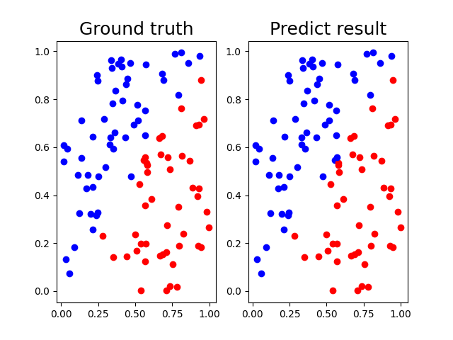

The result of xor dataset
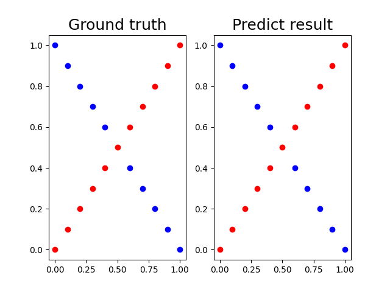

#### Accuracy and loss curve
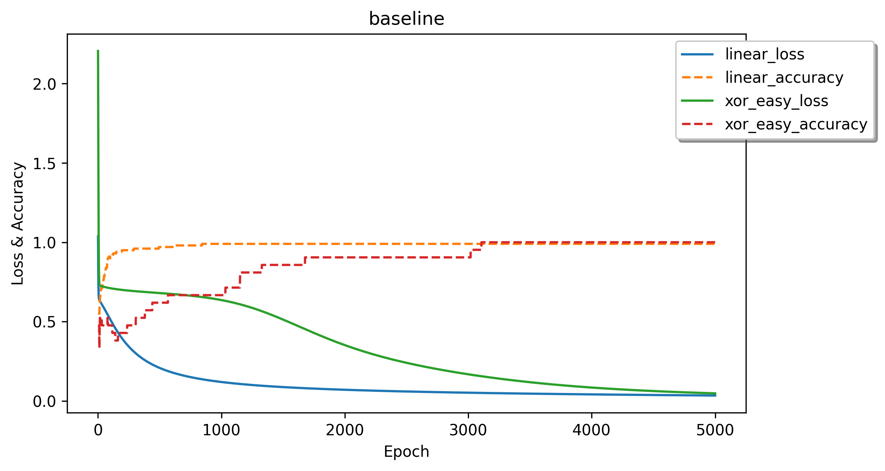

## Discussion

In this section, I'm going to provide different experiments of hyperparameter in xor dataset for discussion.

#### Number of hidden units

I experimented **2, 4, 8, 16, 32 of hidden units size** in both hidden layer. As the result shown below, larger hidden unit size achives better results. This is reasonable since model network is getting complex, it is easily to get good training result.

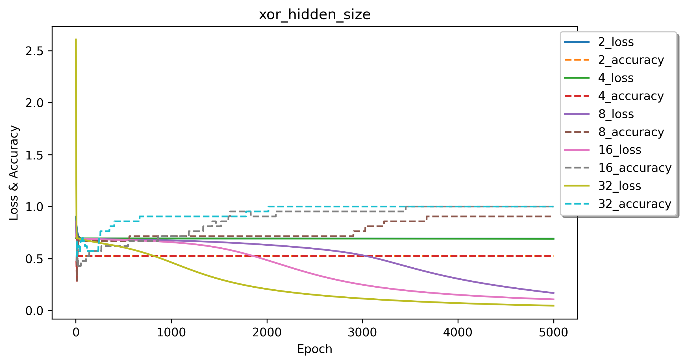

#### Loss functions

I experimented **binary cross entropy and mean square error** loss functions. As the result shown below, both loss functions can achieve similar result, but the **binary cross entropy** loss function should be converge faster since **binary cross entropy** has larger gradients compare to **mean square error** when the loss is high, so **binary cross entropy** should converge faster.

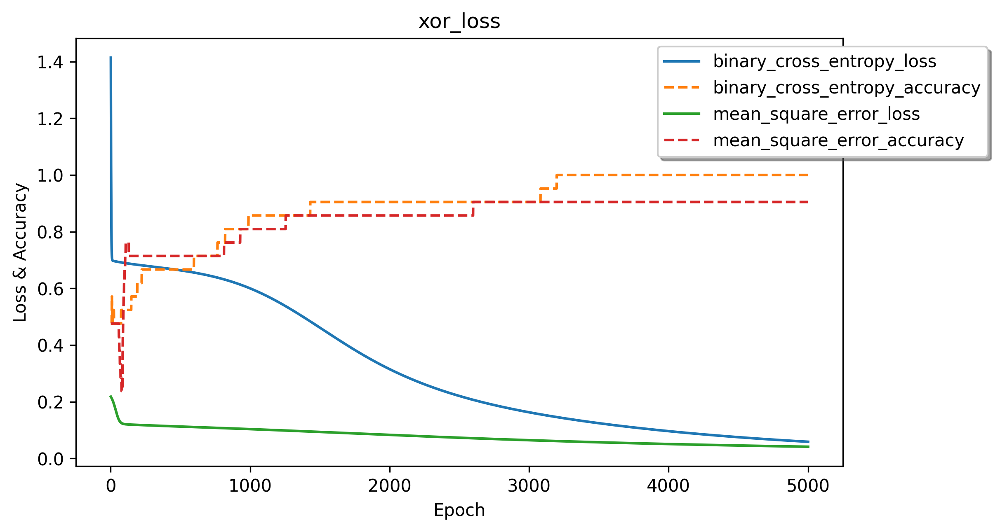

#### Activation functions

I experimented **sigmoid, relu, tanh and linear (without activation)** activation functions for hidden layer. As the result shown below, except **linear**, all of the activation functions can achieve similar better result at the end but **relu** and **tanh** converge faster.

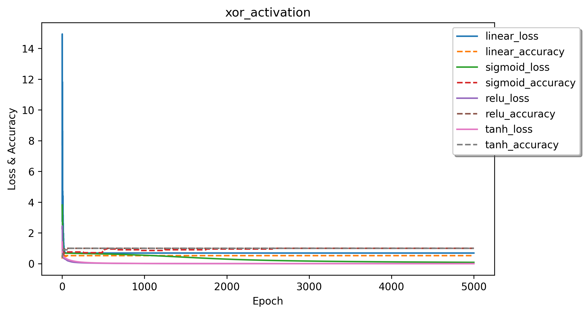

Train without activation function is only able to learn a linear decision boundary. Since xor dataset problem has multiple decision boundary, train with **linear** activation function cannot get a better result.

Since **relu** and **tanh** have the larger gradient than **sigmoid** in most cases, **relu** and **tanh** should be coverge faster.

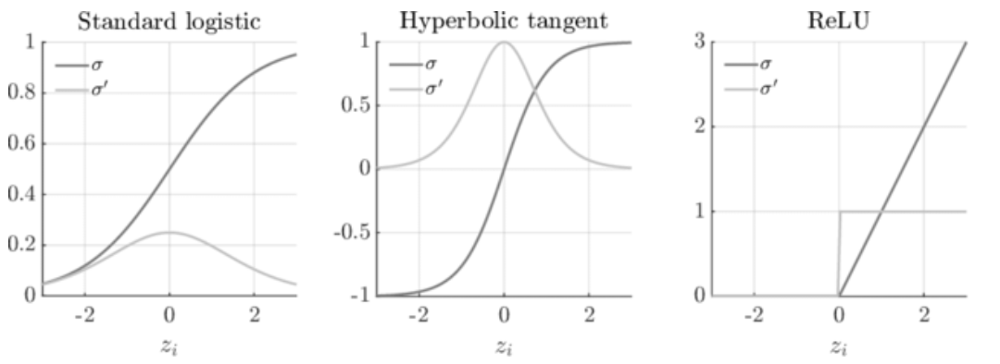

Both implementation of **relu** and **tanh** are provided in last section.

#### Learning rates

I experimented **0.1, 0.01, 0.001** of learning rates. As the result shown below, smaller learning rate affects the results.

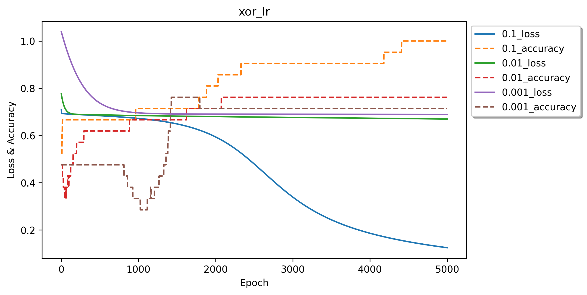

Since our default activation is **sigmoid**, the gradient is very small when backpropagation with smaller learning rate, and easily happens **vanishing gradient**. I change activation to **tanh** and observe that it can be converge to similar result at the end, larger learning rate converge faster.

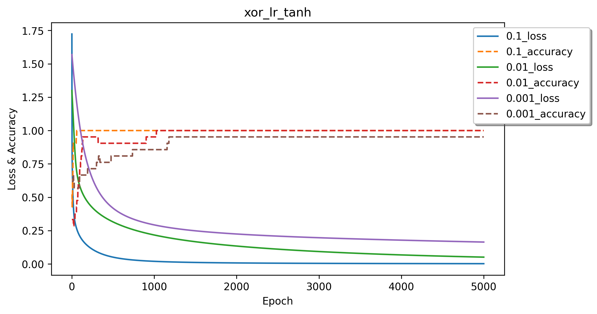

#### Optimizers

I experimented **sgd, momentum, adam** as optimizers. As the result shown below, all of the optimizers achieve similar better result at the end but **adam** is the fastest converge compare to momentum and sgd.

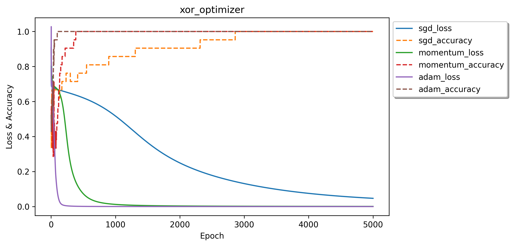

**Momentum** leverage previous gradients as reference to control the update capacity each step. If direction of gradient is same, larger gradient in current step; else smaller gradient.

**Adam** modify learning rates each update step by leveraging sum of squared of history gradients. When the earlier steps, learning rate is modified to larger for update faster, and smaller at latest step.

Both implementation of **momentum** and **adam** are provided in last section.

## Extra

I attached some of the advanced of neural network's layer implementation details in this section as references.

#### Implementation of different activation functions

```python
class Relu(Layer):
    def __init__(self):
        super().__init__()

    def forward(self, x):
        """
        x: estimated data
        """
        self.input = x
        self.output = np.maximum(0, x)

    def backward(self, grad) -> np.ndarray:
        """
        grad: gradient
        return: gradient w.r.t to input data
        """
        return grad * (self.input > 0)


class Tanh(Layer):
    def __init__(self):
        super().__init__()

    def forward(self, x):
        """
        x: estimated data
        """
        self.input = x
        self.output = np.tanh(x)

    def backward(self, grad) -> np.ndarray:
        """
        grad: gradient
        return: gradient w.r.t to input data
        """
        return grad * (1 - self.output ** 2)

```

#### Implementation of different optimizers

```python
class Momentum(Optimizer):
    def __init__(self, params: dict[Parameter], lr=0.01, momentum=0.9):
        """
        params: dict of Parameter
        lr: learning rate
        momentum: momentum
        """
        super().__init__(params, lr)
        self.momentum = momentum
        self.v = {}
        for key in self.params:
            self.v[key] = np.zeros_like(self.params[key].data)

    def step(self):
        for key in self.params:
            self.v[key] = self.momentum * self.v[key] - self.lr * self.params[key].grad
            self.params[key].data += self.v[key]


class Adam(Optimizer):
    def __init__(self, params: dict[Parameter], lr=0.01, beta1=0.9, beta2=0.999):
        """
        params: dict of Parameter
        lr: learning rate
        beta1: beta1
        beta2: beta2
        """
        super().__init__(params, lr)
        self.beta1 = beta1
        self.beta2 = beta2
        self.m = {}
        self.v = {}
        self.iter = 1
        for key in self.params:
            self.m[key] = np.zeros_like(self.params[key].data)
            self.v[key] = np.zeros_like(self.params[key].data)

    def step(self):
        for key in self.params:
            self.m[key] = self.beta1 * self.m[key] + (1 - self.beta1) * self.params[key].grad
            self.v[key] = self.beta2 * self.v[key] + (1 - self.beta2) * (self.params[key].grad ** 2)
            m_hat = self.m[key] / (1 - self.beta1 ** self.iter)
            v_hat = self.v[key] / (1 - self.beta2 ** self.iter)
            self.params[key].data -= self.lr * m_hat / (np.sqrt(v_hat) + 1e-7)

    def zero_grad(self):
        super().zero_grad()
        self.iter += 1

    def __del__(self):
        self.iter = 1
```

#### Implementation of convolution layer

```python
class Convolution2D(Layer):
    def __init__(self, input_size, output_size, kernel_size):
        """
        input_size: input data channel size
        output_size: output data channel size
        kernel_size: kernel size
        """
        super().__init__()
        self.params['W'] = Parameter(
            np.random.randn(input_size, output_size, kernel_size, kernel_size),
            np.zeros((input_size, output_size, kernel_size, kernel_size))
        )
        self.params['b'] = Parameter(
            np.random.randn(1, output_size),
            np.zeros((1, output_size))
        )
        self.kernel_size = kernel_size

    def _get_output_shape(self, input_size) -> int:
        """
        input_size: input data size
        return: output data size
        """
        return (input_size - self.kernel_size) // 1 + 1

    def forward(self, x):
        """
        x: input data
        """
        self.input = x
        self.output = np.zeros(
            (x.shape[0],
             self.params['W'].data.shape[1],
             self._get_output_shape(x.shape[2]),
             self._get_output_shape(x.shape[3]))
        )
        for i in range(x.shape[0]):
            for j in range(self.params['W'].data.shape[1]):
                for k in range(self._get_output_shape(x.shape[2])):
                    for l in range(self._get_output_shape(x.shape[3])):
                        self.output[i, j, k, l] = np.sum(
                            self.params['W'].data[:, j, k: k + self.kernel_size, l: l + self.kernel_size] *
                            x[i, :, k: k + self.kernel_size, l: l + self.kernel_size]
                        ) + self.params['b'].data[0, j]

    def backward(self, grad) -> np.ndarray:
        """
        grad: gradient
        return: gradient w.r.t to input data
        """
        self.params['W'].grad = np.zeros(self.params['W'].data.shape)
        self.params['b'].grad = np.zeros(self.params['b'].data.shape)
        for i in range(grad.shape[0]):
            for j in range(grad.shape[1]):
                for k in range(grad.shape[2]):
                    for l in range(grad.shape[3]):
                        self.params['W'].grad[:, j, k:k + self.kernel_size, l:l + self.kernel_size] += \
                            grad[i, j, k, l] * self.input[i, :, k:k + self.kernel_size, l:l + self.kernel_size]
                        self.params['b'].grad[0, j] += grad[i, j, k, l]
        return np.sum(grad * self.params['W'].data, axis=(1, 2, 3))

```

## References
[1] https://www.researchgate.net/figure/Graphs-of-the-commonly-used-activation-functions-and-their-derivatives-as-listed-in-Table_fig1_353354203